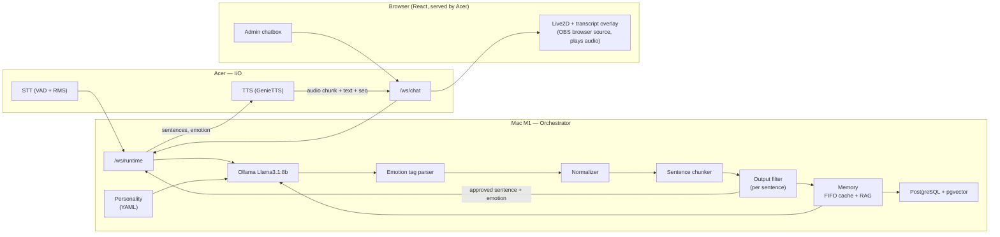
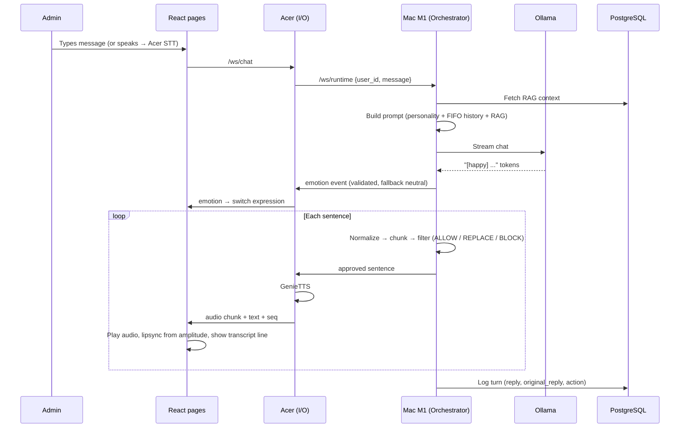

# Mika-sama Project v1 — Analysis

> Snapshot of the project folder as of **2026-09-27** (after the Phase 0 setup). The design itself lives in [top_secret.md](top_secret.md) (the authoritative spec); this file describes what actually exists on disk, how the docs relate to each other, and what is still undecided.

## 1. What Is This Project?

**Mika-sama** is an **AI VTuber**: a virtual streamer powered by an LLM (Llama 3.1:8b via Ollama) that talks, shows emotions through a Live2D avatar, and later will sing, play games and see its own stream. The design is **event-driven microservices** across two machines:

| Machine | Role |
|---------|------|
| **Mac M1** (8 GB RAM) | Orchestrator: LLM, state, conversation history, memory (FIFO + RAG), database, output filter, routing |
| **Acer** Aspire A715-76 (i5-12450H, 16 GB, Intel UHD) | I/O only: STT, TTS, chat listener, hosts the React pages (avatar + transcript overlay, admin chatbox) |

---

## 2. Implementation Status

**Phases 0–3 of [implementation_plan.md](implementation_plan.md) are complete.** The spikes are done (results in the plan) and the shared contracts exist. The server has its configuration, database layer, personality and LLM core: Ollama streaming, emotion tag, normalizer and sentence chunker. The output filter, memory, server wiring, the client and the frontend don't exist yet; Phase 4 is next.

- `mika/` so far holds:
  - `mika/shared`: the `mika-shared` package with its tests;
  - `mika/server`: config, schema, connection pool, queries, `/health`, tests;
  - `mika/frontend/src/types/events.ts`: the TypeScript types generated from `mika/shared`.

  An earlier version of this file described a full scaffold under `mika/`; that scaffold never existed on disk.
- Databases:
  - **Mac (the real one):** PostgreSQL 18 from the EnterpriseDB installer (`/Library/PostgreSQL/18`, port 5432), with pgvector 0.8.6 built from source. Databases `mika` and `mika_test`. Homebrew's `postgresql@17` was installed on 2026-09-30 but is unused and stopped.
  - **Acer (tests):** PostgreSQL 16 + pgvector 0.6.0 inside WSL Ubuntu, on port 5433. The Windows PostgreSQL 16 service on port 5432 belongs to other projects.
- The folder is a **git repository** with remote [github.com/OnicronPandora/mika_sama_v1](https://github.com/OnicronPandora/mika_sama_v1) (MIT license). Work is pushed to `dev-mode`, and the admin merges it into `main` through a pull request. `.gitignore` is GitHub's Python template plus project rules that keep out `others/`, Cubism Core, `.conda/`, `node_modules/`, secrets, logs, and the local agent skill library (`skills/`, `.agent/`, `.agents/`).
- The Acer has a project conda env at `.conda/` (Python 3.11.9) with `genie-tts` 2.0.2, `ollama` 0.6.2, `mika-shared` (editable) and the server's requirements.
- `spikes/` holds the Phase 0 experiments; their results are recorded in the implementation plan.

---

## 3. What's On Disk

```
mika_sama_project_v1/
├── .gitignore
├── .claude/launch.json                     # Dev-server config for the Spike C preview
├── .conda/                                 # Acer's Python 3.11.9 env (git-ignored)
├── docs/                                   # Design docs (see section 4)
│   ├── top_secret.md                       # Authoritative spec (SRS + decision log)
│   ├── implementation_plan.md              # Approved plan + Phase 0 results
│   ├── project_analysis.md                 # This file
│   ├── Build a React Page.md               # Frontend plan
│   ├── Building features.md                # Singing / gaming / vision strategy
│   ├── Ouput Filter Protocol.md            # Output filter design
│   └── STT System with VAD.md              # STT design + known deadlock
│
├── mika/
│   ├── shared/                             # mika-shared: enums, payloads, WS events, TS codegen, tests
│   ├── server/                             # Config, DB, personality, LLM core (Ollama, tag, normalizer, chunker), tests
│   └── frontend/src/types/events.ts        # Generated from mika/shared (do not edit by hand)
│
├── others/
│   ├── 2D/miku_pro/                        # Live2D avatar (see 3.1)
│   │   ├── ReadMe.txt                      # License notes (Japanese)
│   │   ├── miku_sample_t05.cmo3            # Cubism Editor model source (18 MB)
│   │   ├── miku_sample_t02.can3            # Cubism Editor animation source
│   │   └── runtime/                        # Exported runtime model (t04)
│   │       ├── miku_sample_t04.model3.json
│   │       ├── miku_sample_t04.moc3
│   │       ├── miku_sample_t04.physics3.json
│   │       ├── miku_sample_t04.cdi3.json   # Parameter display names
│   │       ├── miku_sample_t04.2048/texture_00.png
│   │       └── motion/miku_01..08.motion3.json
│   └── voice/                              # TTS voice (see 3.2)
│       ├── mikav3_onnx_model/              # ONNX graphs (fp32) + weights (fp16 .bin), ~335 MB total
│       ├── ref_data/55.wav, 55.txt         # Reference audio + its transcript
│       └── GenieData/                      # GenieTTS resources (~390 MB, copied from an earlier project)
│
├── spikes/                                 # Phase 0 experiments (see spikes/README.md)
│   ├── spike_a_ollama/                     # Ollama latency script, to run on the Mac
│   ├── spike_b_tts/                        # GenieTTS speed test + results/acer.md
│   └── spike_c_live2d/                     # Vite page: Live2D + lipsync (public/ assets git-ignored)
│
├── skills/                                 # 50 agent skill folders (local tooling, git-ignored)
├── .agent/skills.json                      # Points agents at skills/ (git-ignored)
└── .agents/skills.json                     # Identical copy of the above (git-ignored)
```

### 3.1 Live2D model

| Item | State |
|------|-------|
| Runtime model | `miku_sample_t04` (Cubism 3+ format: `.moc3`, `model3.json`), one 2048 texture, physics, display info |
| Motion groups | `Idle` (3), `Tap` (2), `Flick` (2), `FlickUp` (1) |
| Parameter groups | `LipSync` → `ParamMouthOpenY`; `EyeBlink` → `ParamEyeLOpen`, `ParamEyeROpen` |
| **Expressions** | **None.** No `.exp3.json` files and no `Expressions` entry in `model3.json`. These must be created (decided in the spec). |
| Hit areas | None |
| Parameters usable for expressions | `ParamEyeLSmile`, `ParamEyeRSmile`, `ParamBrowLY/RY`, `ParamBrowLX/RX`, `ParamBrowLAngle/RAngle`, `ParamBrowLForm/RForm`, `ParamMouthForm`, `ParamCheek` (59 parameters total) |
| Version mismatch | The editor source is **t05** (`.cmo3`) but the runtime export is **t04**. Re-exporting from t05 may change the runtime files. Check before building on the t04 files. |
| License | Live2D free material license: individuals and small businesses may use it commercially after agreeing to the terms; medium/large businesses only for private testing. The character is **Hatsune Miku**, so Crypton's character guidelines also apply if the stream is monetized. |

`.exp3.json` files are plain JSON parameter overrides, so they can be written by hand or in Cubism Viewer; Cubism Editor is only needed for changes to the model itself.

### 3.2 Voice

| Item | State |
|------|-------|
| Model | `mikav3_onnx_model`: `prompt_encoder`, `t2s_encoder`, `t2s_first_stage_decoder`, `t2s_stage_decoder`, `t2s_shared`, `vits`. The layout matches a GPT-SoVITS ONNX export, which is the format GenieTTS runs. |
| Reference | `ref_data/55.wav` + `55.txt` → the spec's `REF_VOICE_PATH` and `REF_TEXT` |

---

## 4. Documents

| Doc | Purpose | Status |
|-----|---------|--------|
| [top_secret.md](top_secret.md) | System Requirement Specification | **Authoritative.** Contains the 2026-09-26 decision log. |
| [Ouput Filter Protocol.md](Ouput%20Filter%20Protocol.md) | Filter stages, FilterAction, FilterResult | Partly superseded: its pipeline order and two of its three BLOCK definitions |
| [STT System with VAD.md](STT%20System%20with%20VAD.md) | Voice input pipeline, deadlock report | Partly superseded: "Orchestrator: Acer" |
| [Build a React Page.md](Build%20a%20React%20Page.md) | Frontend build steps, two-page split | Partly superseded: "expression/hotkey"; steps have two "Third" items |
| [Building features.md](Building%20features.md) | Singing / gaming / vision modules | Still valid; has open questions (section 7) |

### Statements in sub-docs that the spec overrides

| Doc | Says | Spec now says |
|-----|------|---------------|
| STT System with VAD.md | "Orchestrator: Acer (Client)" | Mac M1 is the only orchestrator |
| STT System with VAD.md | "... -> TTS -> Log response into Database -> STT" | Logging happens on the Mac; it does not wait for TTS on the Acer |
| Ouput Filter Protocol.md | "Increment Filter -> Approved Text Stream -> Text Chunker" | Normalizer -> Sentence Chunker -> Filter (per sentence) -> TTS |
| Ouput Filter Protocol.md | BLOCK: "Trigger TTS until it touch the prohibited word" / "speak safe fallback/toast" | BLOCK: discard the pending unsafe segment, generate a safe replacement, speak it |
| Build a React Page.md | "trigger an expression/hotkey in 2D model json file" | Create `.exp3.json` expressions per emotion; the model has no hotkeys |
| top_secret.md (old) | Request payload: user_id, message, history, rag_context | user_id, message only |
| top_secret.md (old) | /synthesize endpoint on the Acer | Removed |

---

## 5. Target Architecture (from the spec)



## 6. Data Flow (one turn)



---

## 7. Open Items

### Resolved (2026-09-27, recorded in the spec's decision log)

| # | Area | Resolution |
|---|------|------------|
| 1 | Filter | BLOCK replacement is generated by a second llama3.1:8b call. The AI classifier uses llama3.1:8b with conversation context. Latency accepted. |
| 2 | Memory | Prompt context is built from both `reply` and `original_reply`. |
| 2b | Fine-tuning | The dataset is built from `reply` only. |
| 3 | Database | Schema extended: `chat_logs`, `users`, new `memory_embeddings` and `personality_traits` tables. |
| 4 | Intent | Set by the system: `filter_incident` when any sentence was not ALLOW, `error_recovery` after an error or timeout, otherwise `casual_conversation`. |
| 5 | Personality | Two layers: fixed YAML core + learned traits in `personality_traits`. |
| 6 | STT | Half-duplex, driven by browser playback events. |
| 12 | LLM config | `num_predict=150`. |
| 15 | Embeddings | `nomic-embed-text` → `vector(768)`. (Where it runs: see #23.) |
| 17 | Filter | Classifier timeout or invalid output = unsafe (REPLACE). |
| 18 | Filter | After a BLOCK, the replacement is spoken and the reply continues. |
| 19 | Personality | v1 only reads `personality_traits`; automatic writing comes later. |
| — | Ollama | `OLLAMA_NUM_PARALLEL=1` on the Mac (Phase 0, Spike A: the 8 GB M1 serves one request at a time). |
| 23 | Embeddings | `nomic-embed-text` runs on the Mac's CPU inside the server process, not through Ollama, so it never unloads `llama3.1:8b`. |

### Handled during implementation (no decision needed)

| # | Area | Action |
|---|------|--------|
| 9 | Async | The deadlock and swallowed `CancelledError` are likely the same bug. Re-raise `CancelledError`, stop tasks with `task.cancel()`/sentinels, use `asyncio.TaskGroup` / `asyncio.timeout()` instead of a polling loop. |
| 10 | Schema | Use `Field(default_factory=dict)` for `personality`. |
| 11 | Security | Check the `Origin` header on `/ws/*` (CORS middleware does not cover WebSockets). |
| 14 | Repo | Done (2026-09-27): pushed to `dev-mode` on GitHub; merged into `main` through a pull request. |

### Still open

| # | Area | Question |
|---|------|----------|
| — | — | Nothing open. New questions get added here as they come up. |

### Deferred (after the core works)

| # | Area | Question |
|---|------|----------|
| 7 | Stakeholders | Co-host and chat channel design (v1 is admin only: chatbox + voice). |
| 8 | Features | Vision output destination, what singing pushes to the LLM, Acer capacity for feature models. |
| 13 | Live2D | t05 source vs t04 runtime mismatch (section 3.1). Compare both in Cubism Viewer. |
| 16 | STT | Interrupting Mika while she speaks. |

---

## 8. Tech Stack

| Component | Technology |
|-----------|-----------|
| Backend language | Python 3.11.9 (Conda + Pip, `requirements.txt`) |
| Web framework | FastAPI + Uvicorn, lifespan startup |
| Real-time comms | WebSocket (`/ws/runtime` on Mac, `/ws/chat` on Acer) |
| LLM | Ollama → Llama 3.1:8b (temperature 0.7, num_predict 400) |
| Database | PostgreSQL + pgvector, psycopg3 `AsyncConnectionPool` |
| Validation | Pydantic v2 |
| TTS | GenieTTS (CPU), `mikav3_onnx_model` |
| STT | VAD + RMS |
| Frontend | React + TypeScript + Vite, Live2D (Cubism), Web Audio for playback and lipsync |
| Streaming | OBS (browser source with audio) |
| Config | YAML (personality), Python (system), `.env` (DB secrets) |
| Fine-tuning (later) | Unsloth on Colab after 1000 conversations |

---

## 9. Suggested Build Order

> The detailed, reviewable version of this is [implementation_plan.md](implementation_plan.md).

| Step | Work | Why this order |
|------|------|----------------|
| 1 | `git init`, create the `mika/` scaffold (server, client, frontend, shared) | Nothing exists yet |
| 2 | Shared schemas and events (enums, request/response payloads, WS event types) | Both machines and the frontend depend on them |
| 3 | Server config, DB pool, DB schema script (resolve open item 3 first) | Foundation for memory and logging |
| 4 | Personality loader + LLM streaming engine + emotion tag parser | Core reply path |
| 5 | Normalizer + sentence chunker + output filter (resolve open item 1 first) | Everything spoken passes through it |
| 6 | Memory (FIFO cache + RAG) and state manager | Needed to build prompts from `user_id` + `message` alone |
| 7 | `/ws/runtime` + server `main.py` with clean shutdown (open item 9) | Wire the Mac side together |
| 8 | Acer: WS connector, GenieTTS, STT + VAD, `/ws/chat` | I/O layer |
| 9 | Live2D expressions (`.exp3.json` × 5) | Needed before the avatar page can show emotions |
| 10 | React: avatar + transcript page (audio queue, lipsync), admin chatbox page | Visual layer |
| 11 | OBS integration | Last mile |
